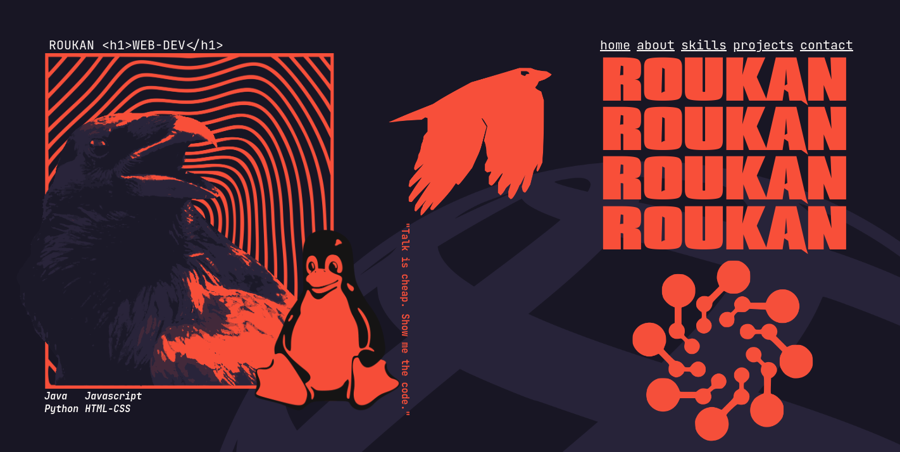

# 🚀 Roucan WEB-DEV - Portfólio Pessoal

Bem-vindo ao meu portfólio pessoal como desenvolvedor web! Um espaço onde design minimalista encontra funcionalidade robusta.

## ✨ Demonstração

## 🛠 Tecnologias Utilizadas

- **Frontend**:  
  
  
  

- **Ferramentas**:  
  
  

## 🎨 Design Features

- Layout responsivo com Grid CSS e Flexbox
- Tipografia personalizada com `Krux Grunge` e `JetBrains Mono`
- Efeitos visuais com `transform` e `z-index`
- Paleta de cores minimalista:
  - `--white: #faf7f5`
  - `--black: #141414`
  - `--focus: #f84f39`

## 📂 Estrutura do Projeto
